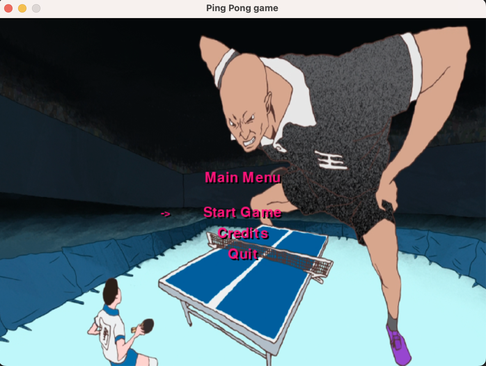
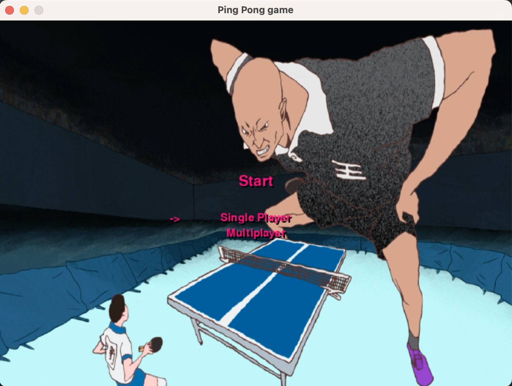
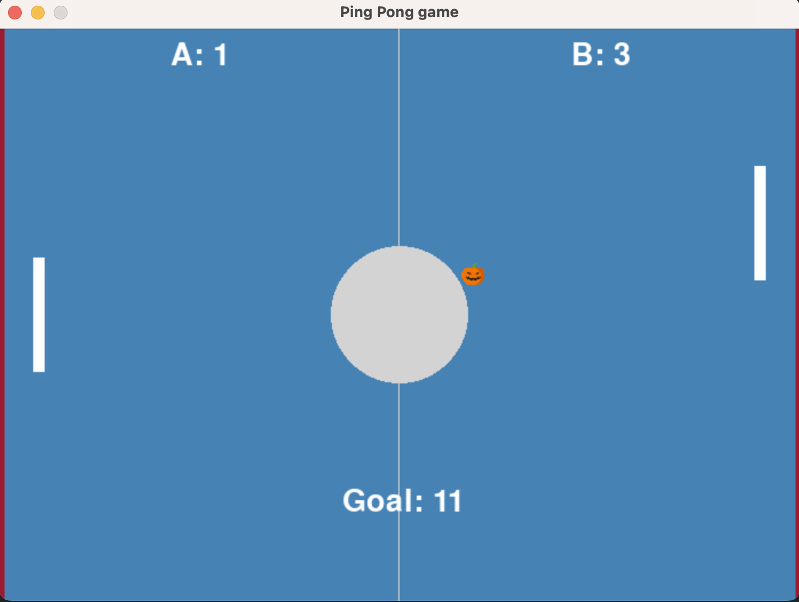
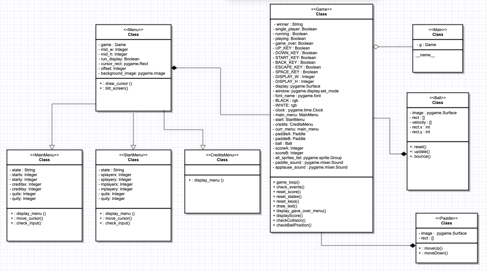

# Pong Game 
 Made with lots of love <3 by Mohit Singh, Damyon Olson and Noah Doering

This is a simple implementation of the classic Pong game using Python and Pygame.

## Game Image





## Game Overview

Pong is a two-dimensional sports game that simulates table tennis. The player controls an in-game paddle by dragging it vertically across the left or right side of the screen’s boundary. The objective is to hit the ball back and forth against the opponent's paddle until the opponent misses the ball or the player fails to hit it back. The game ends when one of the players reaches 10 points.

## Program Versions

- OS: MacBook Air
- Python: 3.9.6
- Pygame: 2.1.2

## The motivation behind the game chosen

The Pong game is a classic arcade game that has been around for decades. It is a simple and fun game that involves two paddles and a ball. The objective of the game is to hit the ball past the opponent's paddle. I chose to build this game because it is a fun and challenging game that can be enjoyed by people of all ages.

## Reasoning behind the structure

The game is structured using the object-oriented programming paradigm. The game consists of three main classes: Paddle, Ball, and Game. The Paddle class represents the paddles used to hit the ball. The Ball class represents the ball that moves around the screen. The Game class is responsible for running the game, keeps track of the score of the players and handling the game events.

## How to Run the Game

1. Clone the repository or download the code as a zip file and extract it to your desired location.
2. Open a terminal or command prompt and navigate to the directory where the game files are located.
3. Run the following command to start the game:

    ```python main.py```

## How to Play

- Use the up and down arrow keys to move the left paddle up and down.
- Use the W and S keys to move the right paddle up and down.
- The game starts as soon as you run it.
- The first player to reach 11 points wins the game.
- After each point, the ball is served again.

### Image of classes and functions and connections


In relation to the rubric, the requirements were to have a Main, Game Loop, Model, View, Controller, and Entities - 
During the project, we opted to keep Main, Controller, Model, and View.
Main is where the game launches officially.
The Controller folder contains our Game() class, which acts as both the Game Loop, View and Controller for the game.
The Model folder contains the classes for both Ball and Paddle which are used by Game() in the game loop. Ball and Paddle update within the gameloop.
The View folder contains the Menue class which displays MainMenu, StartMenu, and Credits.
Main is not inside of any folder, and is used to run the entire program. Main calls to Game() which calls to Menu().

## Issues and Solutions
### Paddle clipping through ball
It seems like the paddle sprite is clipping through the ball sprite sometimes. This could be happening because the collision detection is not accurate or because the sprites are not positioned correctly.
Here are some steps that can be tried to fix this issue:
1. Making sure the paddle and ball sprites are positioned correctly: We can check the position of the sprites and make sure they are not overlapping or positioned too close to each other. We can also adjust the position of the sprites by changing the rect.x and rect.y attributes of the sprite's rect object.
2. Improving the collision detection: we can improve the collision detection by using a more accurate collision detection method. For example, instead of using colliderect, you can use collide_rect or collide_circle to detect collisions between the sprites.
3. Adjusting the size of the sprites: If the sprites are too big, they may be more prone to clipping through each other. We can adjust the size of the sprites by changing the width and height parameters when creating the sprite.
4. Using smaller time steps: We can also improve the collision detection by using smaller time steps in the game loop. This will allow for more accurate detection of collisions between the sprites.
5. Adjusting the speed of the sprites: If the sprites are moving too fast, they may be more prone to clipping through each other. We can adjust the speed of the sprites by changing the velocity parameters or by adding friction to the movement.

## Future Work

Some possible improvements and new features that can be added to the game:

- Add different difficulty levels.
- Add power-ups that can affect the ball's speed, size, and trajectory.
- Improve the game graphics and sounds.
- Add the ability to pause and resume the game.
- Implement a high score system.
- Add the option to choose different types of paddles and balls.
- After each point, add a 3-second pause before the ball is served again.

## Generalization

The game could be generalized to other types of games or applications that involve two paddles and a ball. For example, it could be adapted to create a breakout-style game, where the player controls a paddle to prevent a ball from breaking bricks. It could also be used as a starting point for creating other types of sports games, such as tennis, squash, or badminton.
